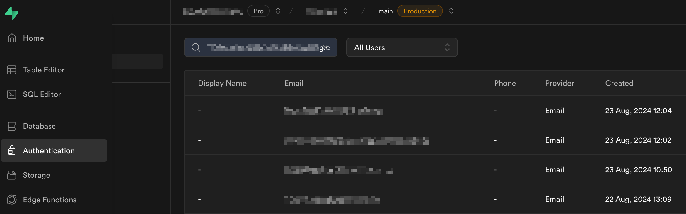
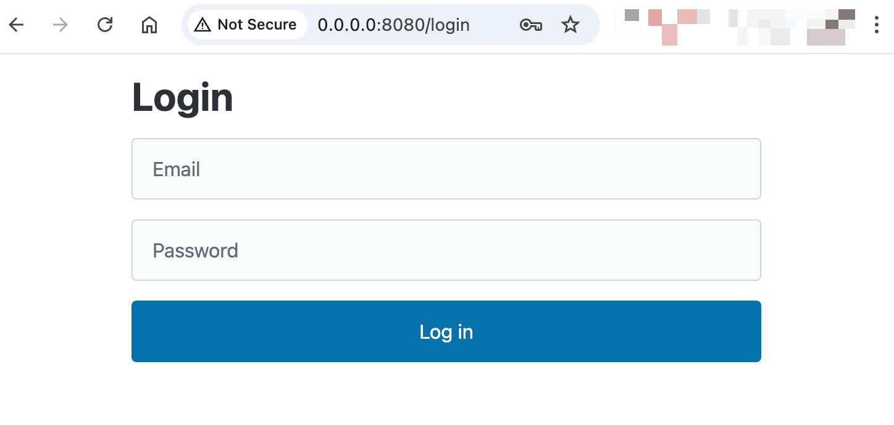

# FastHTML Supabase Authentication Example

[Supabase](https://supabase.com) comes with a very straightforward authentication solution. This repo is a minimal example showing how to use it with [FastHTML](https://github.com/AnswerDotAI/fasthtml).

First create a user in the authentication section of your Supabase project. Note the email and password you set for the user.

Second, clone this repo and run `pip install -r requirements.txt` in the terminal from this folder.

Third, start the app by running `python main.py` in the terminal.

This will take you to a login screen. Enter the email address and password for your supabase user.

If you enter the correct credentials, it will take you to a dashboard screen
